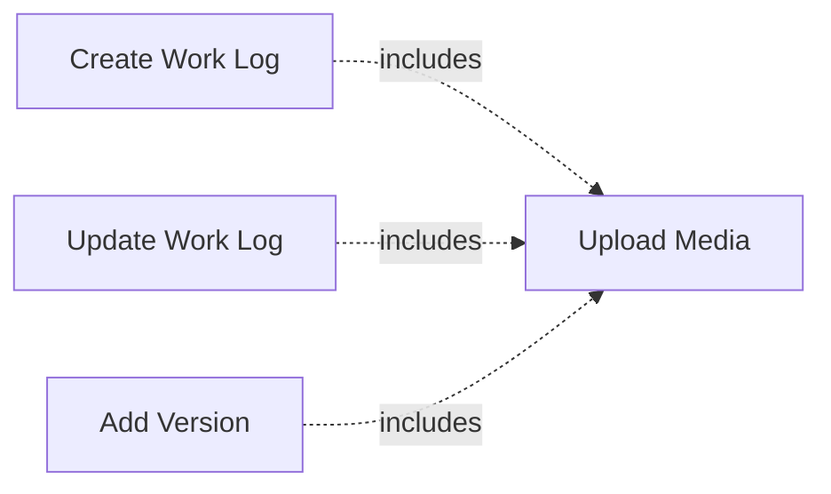
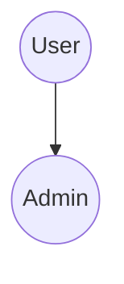

# NEBWORK - Use Case Documentation

> **Project:** NEBWORK - Work Logging & Knowledge Management Platform  
> **Version:** 1.0.0  
> **Last Updated:** February 4, 2026  
> **Team:** KADA Group 2 - Arrizal, Regina, Salwanetta, Gideon, Jovan

---

## 📑 Table of Contents

1. [Overview](#overview)
2. [Actors](#actors)
3. [Use Case Diagram](#use-case-diagram)
4. [Use Case List](#use-case-list)
5. [Detailed Use Cases](#detailed-use-cases)
6. [Use Case Relationships](#use-case-relationships)

---

## Overview

NEBWORK adalah platform kolaborasi dan manajemen pengetahuan yang dirancang untuk membantu perusahaan menyimpan dan mengelola institutional knowledge melalui work logs. Platform ini menyediakan fitur authentication, work log management, AI chatbot, dan kolaborasi tim.

**Tujuan Sistem:**
- Memfasilitasi pencatatan dan dokumentasi pekerjaan karyawan
- Menyediakan sistem version control untuk work logs
- Memungkinkan kolaborasi antar karyawan
- Menyediakan AI chatbot untuk knowledge retrieval
- Mengelola data karyawan (untuk admin)

---

## Actors

### 1. **User (Employee/Karyawan)**
**Deskripsi:** Karyawan biasa yang menggunakan sistem untuk mencatat work log dan berkolaborasi.

**Karakteristik:**
- Memiliki akun dengan role "user"
- Dapat membuat, mengedit, dan menghapus work log milik sendiri
- Dapat berkolaborasi dengan karyawan lain
- Dapat menggunakan AI chatbot untuk mencari informasi
- Dapat mengelola profil pribadi

**Hak Akses:**
- ✅ Manajemen work log pribadi
- ✅ Kolaborasi dengan user lain
- ✅ AI chatbot
- ✅ Update profil pribadi
- ❌ Manajemen karyawan (admin only)

---

### 2. **Admin (Administrator)**
**Deskripsi:** Administrator sistem yang memiliki akses penuh untuk mengelola karyawan dan semua fitur user.

**Karakteristik:**
- Memiliki akun dengan role "admin"
- Memiliki semua hak akses user
- Dapat mengelola data karyawan (CRUD)
- Dapat melihat semua work logs dalam sistem

**Hak Akses:**
- ✅ Semua hak akses User
- ✅ Tambah karyawan baru
- ✅ Edit data karyawan
- ✅ Hapus karyawan
- ✅ Lihat semua work logs

---

### 3. **System (AI Chatbot)**
**Deskripsi:** Sistem AI yang berinteraksi dengan user untuk menjawab pertanyaan berdasarkan work logs.

**Karakteristik:**
- Menggunakan DeepSeek-R1-Distill-Llama-70B untuk generate response
- Menggunakan Text Embedding 3 Large untuk semantic search
- Menyimpan chat history per session

---

## Use Case Diagram

### Visual Diagram


### Mermaid Diagram (Alternative)

```mermaid
graph TB
    subgraph "NEBWORK System"
        subgraph "Authentication"
            UC1[Login]
            UC2[Logout]
            UC3[View Profile]
            UC4[Update Profile]
            UC5[Forgot Password]
            UC6[Reset Password]
        end
        
        subgraph "Work Log Management"
            UC7[Create Work Log]
            UC8[View Work Logs]
            UC9[Update Work Log]
            UC10[Delete Work Log]
            UC11[Filter Work Logs]
            UC12[Add Version]
            UC13[View Version History]
        end
        
        subgraph "Collaboration"
            UC14[Add Collaborator]
            UC15[View Collaborators]
            UC16[Remove Collaborator]
        end
        
        subgraph "AI Chatbot"
            UC17[Send Message to Chatbot]
            UC18[View Chat History]
            UC19[View Chat Session]
            UC20[Delete Chat Session]
        end
        
        subgraph "Media Management"
            UC21[Upload Media]
            UC22[View Media]
        end
        
        subgraph "Admin - Employee Management"
            UC23[View All Employees]
            UC24[Add Employee]
            UC25[Edit Employee]
            UC26[Delete Employee]
        end
    end
    
    User((User/Employee))
    Admin((Admin))
    AISystem((AI System))
    
    User --> UC1
    User --> UC2
    User --> UC3
    User --> UC4
    User --> UC5
    User --> UC6
    User --> UC7
    User --> UC8
    User --> UC9
    User --> UC10
    User --> UC11
    User --> UC12
    User --> UC13
    User --> UC14
    User --> UC15
    User --> UC16
    User --> UC17
    User --> UC18
    User --> UC19
    User --> UC20
    User --> UC21
    User --> UC22
    
    Admin --> UC23
    Admin --> UC24
    Admin --> UC25
    Admin --> UC26
    
    UC17 -.-> AISystem
    AISystem -.-> UC17
    
    UC7 -.includes.-> UC21
    UC9 -.includes.-> UC21
    UC12 -.includes.-> UC21
```



---

## Use Case List

### Authentication & Profile Management
| ID | Use Case | Actor | Priority |
|---|---|---|---|
| UC-01 | Login | User, Admin | High |
| UC-02 | Logout | User, Admin | High |
| UC-03 | View Profile | User, Admin | Medium |
| UC-04 | Update Profile | User, Admin | Medium |
| UC-05 | Forgot Password | User, Admin | High |
| UC-06 | Reset Password | User, Admin | High |

### Work Log Management
| ID | Use Case | Actor | Priority |
|---|---|---|---|
| UC-07 | Create Work Log | User, Admin | High |
| UC-08 | View Work Logs | User, Admin | High |
| UC-09 | Update Work Log | User, Admin | High |
| UC-10 | Delete Work Log | User, Admin | Medium |
| UC-11 | Filter Work Logs | User, Admin | Medium |
| UC-12 | Add Version to Work Log | User, Admin | Medium |
| UC-13 | View Version History | User, Admin | Medium |

### Collaboration
| ID | Use Case | Actor | Priority |
|---|---|---|---|
| UC-14 | Add Collaborator | User, Admin | Medium |
| UC-15 | View Collaborators | User, Admin | Low |
| UC-16 | Remove Collaborator | User, Admin | Low |

### AI Chatbot
| ID | Use Case | Actor | Priority |
|---|---|---|---|
| UC-17 | Send Message to Chatbot | User, Admin | High |
| UC-18 | View Chat History | User, Admin | Medium |
| UC-19 | View Chat Session | User, Admin | Medium |
| UC-20 | Delete Chat Session | User, Admin | Low |

### Media Management
| ID | Use Case | Actor | Priority |
|---|---|---|---|
| UC-21 | Upload Media | User, Admin | Medium |
| UC-22 | View Media | User, Admin | Low |

### Admin - Employee Management
| ID | Use Case | Actor | Priority |
|---|---|---|---|
| UC-23 | View All Employees | Admin | High |
| UC-24 | Add Employee | Admin | High |
| UC-25 | Edit Employee | Admin | Medium |
| UC-26 | Delete Employee | Admin | Medium |

---

## Detailed Use Cases

### UC-01: Login

**Actor:** User, Admin

**Deskripsi:** User melakukan login ke sistem menggunakan email dan password.

**Preconditions:**
- User memiliki akun yang terdaftar di sistem
- User belum login

**Postconditions:**
- User berhasil login dan mendapat JWT token
- User diarahkan ke dashboard

**Main Flow:**
1. User membuka halaman login
2. User memasukkan email dan password
3. System memvalidasi kredensial
4. System menggenerate JWT token
5. System mengirim token dan data user
6. User diarahkan ke dashboard

**Alternative Flow:**
- **3a. Kredensial tidak valid**
  - System menampilkan error message
  - User kembali ke step 2
- **3b. Rate limit exceeded (5 attempts dalam 15 menit)**
  - System menolak request
  - User harus menunggu sebelum mencoba lagi

**Business Rules:**
- Email harus valid dan terdaftar
- Password harus sesuai dengan hash di database
- Maximum 5 login attempts per 15 menit per IP

---

### UC-02: Logout

**Actor:** User, Admin

**Deskripsi:** User melakukan logout dari sistem.

**Preconditions:**
- User sudah login (memiliki valid JWT token)

**Postconditions:**
- User berhasil logout
- Token dianggap invalid (client-side)

**Main Flow:**
1. User menekan tombol logout
2. System memproses logout request
3. Client menghapus token dari storage
4. User diarahkan ke halaman login

---

### UC-03: View Profile

**Actor:** User, Admin

**Deskripsi:** User melihat informasi profil pribadi.

**Preconditions:**
- User sudah login

**Postconditions:**
- System menampilkan data profil user

**Main Flow:**
1. User mengakses halaman profile
2. System mengambil data user dari database
3. System menampilkan informasi profil (name, email, division, join_date, profile_photo)

**Data Displayed:**
- Name
- Email
- Role (user/admin)
- Division
- Profile Photo
- Join Date

---

### UC-04: Update Profile

**Actor:** User, Admin

**Deskripsi:** User mengupdate informasi profil pribadi.

**Preconditions:**
- User sudah login

**Postconditions:**
- Data profil user berhasil diupdate

**Main Flow:**
1. User mengakses halaman edit profile
2. User mengubah data (name, division, profile_photo)
3. User menekan tombol save
4. System memvalidasi input
5. System mengupdate data di database
6. System menampilkan success message

**Alternative Flow:**
- **4a. Validasi gagal**
  - System menampilkan error message
  - User kembali ke step 2

**Editable Fields:**
- Name
- Division
- Profile Photo

---

### UC-05: Forgot Password

**Actor:** User, Admin

**Deskripsi:** User request reset password jika lupa password.

**Preconditions:**
- User memiliki akun terdaftar

**Postconditions:**
- Reset token digenerate dan dikirim via email

**Main Flow:**
1. User mengakses halaman forgot password
2. User memasukkan email
3. System memvalidasi email
4. System menggenerate reset token
5. System mengirim email dengan reset link
6. System menampilkan success message

**Alternative Flow:**
- **3a. Email tidak terdaftar**
  - System tetap menampilkan success message (security measure)
- **3b. Rate limit exceeded (5 attempts per jam per email)**
  - System menolak request

**Business Rules:**
- Reset token valid selama 1 jam
- Maximum 5 reset requests per jam per email

---

### UC-06: Reset Password

**Actor:** User, Admin

**Deskripsi:** User mereset password menggunakan token dari email.

**Preconditions:**
- User memiliki valid reset token

**Postconditions:**
- Password user berhasil diubah

**Main Flow:**
1. User mengakses reset link dari email
2. User memasukkan password baru
3. System memvalidasi token
4. System memvalidasi password (strong password policy)
5. System mengupdate password di database
6. System menampilkan success message
7. User diarahkan ke halaman login

**Alternative Flow:**
- **3a. Token invalid atau expired**
  - System menampilkan error message
- **4a. Password tidak memenuhi requirement**
  - System menampilkan error message
  - User kembali ke step 2

**Password Requirements:**
- Minimum 8 karakter
- Minimal 1 huruf besar
- Minimal 1 huruf kecil
- Minimal 1 angka
- Minimal 1 special character (!@#$%^&*...)

---

### UC-07: Create Work Log

**Actor:** User, Admin

**Deskripsi:** User membuat work log baru.

**Preconditions:**
- User sudah login

**Postconditions:**
- Work log baru tersimpan di database
- AI embeddings digenerate untuk work log

**Main Flow:**
1. User mengakses halaman create work log
2. User memasukkan data (title, content, tags)
3. User dapat mengupload media (optional)
4. User menekan tombol save
5. System memvalidasi input
6. System menyimpan work log ke database
7. System menggenerate AI embeddings (background process)
8. System menampilkan success message

**Alternative Flow:**
- **5a. Validasi gagal**
  - System menampilkan error message
  - User kembali ke step 2

**Required Fields:**
- Title
- Content

**Optional Fields:**
- Tags (array)
- Media (images, documents)

---

### UC-08: View Work Logs

**Actor:** User, Admin

**Deskripsi:** User melihat daftar work logs.

**Preconditions:**
- User sudah login

**Postconditions:**
- System menampilkan daftar work logs

**Main Flow:**
1. User mengakses halaman work logs
2. System mengambil work logs dari database
3. System menampilkan work logs dengan informasi:
   - Title
   - Tags
   - Author name
   - Created date
   - Last updated date
   - Collaborators

**Business Rules:**
- User dapat melihat work logs yang dibuat sendiri
- User dapat melihat work logs dimana dia menjadi collaborator
- Admin dapat melihat semua work logs

---

### UC-09: Update Work Log

**Actor:** User, Admin

**Deskripsi:** User mengupdate work log yang sudah ada.

**Preconditions:**
- User sudah login
- User adalah owner atau collaborator dari work log

**Postconditions:**
- Work log berhasil diupdate
- AI embeddings diupdate (background process)

**Main Flow:**
1. User mengakses work log yang ingin diupdate
2. User mengubah data (title, content, tags, media)
3. User menekan tombol save
4. System memvalidasi input
5. System mengupdate work log di database
6. System mengupdate AI embeddings (background process)
7. System menampilkan success message

**Alternative Flow:**
- **1a. User bukan owner atau collaborator**
  - System menampilkan error "Unauthorized"
- **4a. Validasi gagal**
  - System menampilkan error message
  - User kembali ke step 2

---

### UC-10: Delete Work Log

**Actor:** User, Admin

**Deskripsi:** User menghapus work log.

**Preconditions:**
- User sudah login
- User adalah owner dari work log

**Postconditions:**
- Work log dan semua version history terhapus

**Main Flow:**
1. User mengakses work log yang ingin dihapus
2. User menekan tombol delete
3. System menampilkan confirmation dialog
4. User mengkonfirmasi penghapusan
5. System menghapus work log dan version history
6. System menampilkan success message

**Alternative Flow:**
- **1a. User bukan owner**
  - System menampilkan error "Unauthorized"
- **4a. User membatalkan**
  - Proses dihentikan

---

### UC-11: Filter Work Logs

**Actor:** User, Admin

**Deskripsi:** User memfilter work logs berdasarkan kriteria tertentu.

**Preconditions:**
- User sudah login

**Postconditions:**
- System menampilkan work logs yang sesuai filter

**Main Flow:**
1. User mengakses halaman work logs
2. User memilih filter criteria:
   - Tag
   - Start date
   - End date
3. User menekan tombol apply filter
4. System mengambil work logs yang sesuai filter
5. System menampilkan hasil filter

**Filter Options:**
- **Tag:** Filter by specific tag
- **Date Range:** Filter by creation date range

---

### UC-12: Add Version to Work Log

**Actor:** User, Admin

**Deskripsi:** User menambahkan versi baru ke work log (version control).

**Preconditions:**
- User sudah login
- User adalah owner atau collaborator dari work log

**Postconditions:**
- Version baru tersimpan di log_history
- AI embeddings digenerate untuk version baru

**Main Flow:**
1. User mengakses work log
2. User menekan tombol "Add Version"
3. User memasukkan data untuk version baru (title, content, tags)
4. User menekan tombol save
5. System memvalidasi input
6. System menyimpan version ke log_history
7. System menggenerate AI embeddings (background process)
8. System menampilkan success message

**Alternative Flow:**
- **1a. User bukan owner atau collaborator**
  - System menampilkan error "Unauthorized"

---

### UC-13: View Version History

**Actor:** User, Admin

**Deskripsi:** User melihat history versi dari work log.

**Preconditions:**
- User sudah login
- User memiliki akses ke work log

**Postconditions:**
- System menampilkan semua versi dari work log

**Main Flow:**
1. User mengakses work log
2. User menekan tombol "View History"
3. System mengambil semua version dari log_history
4. System menampilkan version history dengan informasi:
   - Version number
   - Title
   - Content preview
   - Author
   - Created date

---

### UC-14: Add Collaborator

**Actor:** User, Admin

**Deskripsi:** User menambahkan collaborator ke work log.

**Preconditions:**
- User sudah login
- User adalah owner dari work log

**Postconditions:**
- Collaborator ditambahkan ke work log
- Collaborator dapat mengedit work log

**Main Flow:**
1. User mengakses work log
2. User menekan tombol "Add Collaborator"
3. System menampilkan daftar karyawan
4. User memilih karyawan yang ingin ditambahkan
5. User menekan tombol add
6. System menambahkan collaborator ke work log
7. System menampilkan success message

**Alternative Flow:**
- **1a. User bukan owner**
  - System menampilkan error "Unauthorized"
- **4a. Karyawan sudah menjadi collaborator**
  - System menampilkan error message

---

### UC-15: View Collaborators

**Actor:** User, Admin

**Deskripsi:** User melihat daftar collaborator dari work log.

**Preconditions:**
- User sudah login
- User memiliki akses ke work log

**Postconditions:**
- System menampilkan daftar collaborators

**Main Flow:**
1. User mengakses work log
2. User menekan tombol "View Collaborators"
3. System mengambil daftar collaborators
4. System menampilkan informasi collaborators:
   - Name
   - Email
   - Division

---

### UC-16: Remove Collaborator

**Actor:** User, Admin

**Deskripsi:** User menghapus collaborator dari work log.

**Preconditions:**
- User sudah login
- User adalah owner dari work log

**Postconditions:**
- Collaborator dihapus dari work log

**Main Flow:**
1. User mengakses work log
2. User melihat daftar collaborators
3. User menekan tombol remove pada collaborator tertentu
4. System menampilkan confirmation dialog
5. User mengkonfirmasi penghapusan
6. System menghapus collaborator dari work log
7. System menampilkan success message

**Alternative Flow:**
- **1a. User bukan owner**
  - System menampilkan error "Unauthorized"

---

### UC-17: Send Message to Chatbot

**Actor:** User, Admin

**Deskripsi:** User mengirim pesan ke AI chatbot untuk mendapatkan informasi dari work logs.

**Preconditions:**
- User sudah login

**Postconditions:**
- System mengirim response dari AI chatbot

**Main Flow:**
1. User mengakses chatbot interface
2. User mengetik pertanyaan
3. User menekan tombol send
4. System mengkonversi pesan ke embedding (Text Embedding 3 Large)
5. System mencari work logs yang relevan menggunakan vector similarity
6. System mengirim context ke DeepSeek-R1-Distill-Llama-70B
7. System menerima response dari AI
8. System menyimpan chat ke database
9. System menampilkan response ke user

**Technical Flow:**
```
User Message 
  → Text Embedding 3 Large (generate embedding)
  → Vector Similarity Search (find relevant work logs)
  → DeepSeek-R1-Distill-Llama-70B (generate response with context)
  → Response to User
```

**Data Stored:**
- Session ID
- User message
- AI response
- Timestamp

---

### UC-18: View Chat History

**Actor:** User, Admin

**Deskripsi:** User melihat daftar chat sessions.

**Preconditions:**
- User sudah login

**Postconditions:**
- System menampilkan daftar chat sessions

**Main Flow:**
1. User mengakses chat history page
2. System mengambil semua chat sessions user
3. System menampilkan session list dengan informasi:
   - Session ID
   - Last message
   - Message count
   - Last activity timestamp

---

### UC-19: View Chat Session

**Actor:** User, Admin

**Deskripsi:** User melihat detail messages dari chat session tertentu.

**Preconditions:**
- User sudah login
- Chat session exists

**Postconditions:**
- System menampilkan semua messages dalam session

**Main Flow:**
1. User memilih chat session dari history
2. System mengambil semua messages dari session
3. System menampilkan messages dengan informasi:
   - Role (user/assistant)
   - Content
   - Timestamp

---

### UC-20: Delete Chat Session

**Actor:** User, Admin

**Deskripsi:** User menghapus chat session.

**Preconditions:**
- User sudah login
- User adalah owner dari chat session

**Postconditions:**
- Chat session terhapus

**Main Flow:**
1. User mengakses chat history
2. User menekan tombol delete pada session tertentu
3. System menampilkan confirmation dialog
4. User mengkonfirmasi penghapusan
5. System menghapus chat session
6. System menampilkan success message

---

### UC-21: Upload Media

**Actor:** User, Admin

**Deskripsi:** User mengupload media (images, documents) ke work log.

**Preconditions:**
- User sudah login
- User sedang create/update work log

**Postconditions:**
- Media tersimpan di cloud storage (DigitalOcean Spaces/AWS S3)
- URL media tersimpan di work log

**Main Flow:**
1. User menekan tombol upload media
2. User memilih file dari device
3. System memvalidasi file (type, size)
4. System mengupload file ke cloud storage
5. System mendapat URL dari uploaded file
6. System menyimpan URL ke work log
7. System menampilkan preview media

**Alternative Flow:**
- **3a. File type tidak didukung**
  - System menampilkan error message
- **3b. File size terlalu besar**
  - System menampilkan error message

**Supported File Types:**
- Images: JPG, PNG, GIF, WebP
- Documents: PDF, DOC, DOCX, XLS, XLSX

**File Size Limit:**
- Maximum 10MB per file

---

### UC-22: View Media

**Actor:** User, Admin

**Deskripsi:** User melihat media yang ada di work log.

**Preconditions:**
- User sudah login
- Work log memiliki media

**Postconditions:**
- System menampilkan media

**Main Flow:**
1. User mengakses work log
2. System menampilkan media preview
3. User dapat menekan media untuk melihat full size
4. System menampilkan media viewer

---

### UC-23: View All Employees

**Actor:** Admin

**Deskripsi:** Admin melihat daftar semua karyawan.

**Preconditions:**
- Admin sudah login
- User memiliki role "admin"

**Postconditions:**
- System menampilkan daftar semua karyawan

**Main Flow:**
1. Admin mengakses employee management page
2. System mengambil semua data karyawan
3. System menampilkan employee list dengan informasi:
   - Name
   - Email
   - Role
   - Division
   - Join Date

**Alternative Flow:**
- **1a. User bukan admin**
  - System menampilkan error "Unauthorized"

---

### UC-24: Add Employee

**Actor:** Admin

**Deskripsi:** Admin menambahkan karyawan baru.

**Preconditions:**
- Admin sudah login
- User memiliki role "admin"

**Postconditions:**
- Karyawan baru tersimpan di database

**Main Flow:**
1. Admin mengakses employee management page
2. Admin menekan tombol "Add Employee"
3. Admin memasukkan data karyawan:
   - Email
   - Name
   - Password
   - Division
   - Role (user/admin)
4. Admin menekan tombol save
5. System memvalidasi input
6. System menyimpan karyawan ke database
7. System menampilkan success message

**Alternative Flow:**
- **5a. Email sudah terdaftar**
  - System menampilkan error message
- **5b. Password tidak memenuhi requirement**
  - System menampilkan error message
- **1a. User bukan admin**
  - System menampilkan error "Unauthorized"

**Required Fields:**
- Email (unique)
- Name
- Password (strong password policy)
- Division
- Role

---

### UC-25: Edit Employee

**Actor:** Admin

**Deskripsi:** Admin mengupdate data karyawan.

**Preconditions:**
- Admin sudah login
- User memiliki role "admin"
- Karyawan exists

**Postconditions:**
- Data karyawan berhasil diupdate

**Main Flow:**
1. Admin mengakses employee management page
2. Admin memilih karyawan yang ingin diedit
3. Admin mengubah data (name, division, role)
4. Admin menekan tombol save
5. System memvalidasi input
6. System mengupdate data karyawan
7. System menampilkan success message

**Alternative Flow:**
- **1a. User bukan admin**
  - System menampilkan error "Unauthorized"

**Editable Fields:**
- Name
- Division
- Role

---

### UC-26: Delete Employee

**Actor:** Admin

**Deskripsi:** Admin menghapus karyawan.

**Preconditions:**
- Admin sudah login
- User memiliki role "admin"
- Karyawan exists

**Postconditions:**
- Karyawan terhapus dari database

**Main Flow:**
1. Admin mengakses employee management page
2. Admin memilih karyawan yang ingin dihapus
3. Admin menekan tombol delete
4. System menampilkan confirmation dialog
5. Admin mengkonfirmasi penghapusan
6. System menghapus karyawan
7. System menampilkan success message

**Alternative Flow:**
- **1a. User bukan admin**
  - System menampilkan error "Unauthorized"
- **5a. Admin membatalkan**
  - Proses dihentikan

---

## Use Case Relationships

### Include Relationships



**Penjelasan:**
- Create Work Log, Update Work Log, dan Add Version dapat include Upload Media sebagai optional step

### Extend Relationships

```mermaid
graph LR
    UC8[View Work Logs] <-.extends.- UC11[Filter Work Logs]
```

**Penjelasan:**
- Filter Work Logs adalah extension dari View Work Logs untuk memberikan filtering capability

### Generalization



**Penjelasan:**
- Admin adalah specialized actor dari User
- Admin memiliki semua capabilities User plus additional admin features

---

## Use Case Priority Matrix

### High Priority (Must Have)
- UC-01: Login
- UC-02: Logout
- UC-05: Forgot Password
- UC-06: Reset Password
- UC-07: Create Work Log
- UC-08: View Work Logs
- UC-09: Update Work Log
- UC-17: Send Message to Chatbot
- UC-23: View All Employees (Admin)
- UC-24: Add Employee (Admin)

### Medium Priority (Should Have)
- UC-03: View Profile
- UC-04: Update Profile
- UC-10: Delete Work Log
- UC-11: Filter Work Logs
- UC-12: Add Version to Work Log
- UC-13: View Version History
- UC-14: Add Collaborator
- UC-18: View Chat History
- UC-19: View Chat Session
- UC-21: Upload Media
- UC-25: Edit Employee (Admin)
- UC-26: Delete Employee (Admin)

### Low Priority (Nice to Have)
- UC-15: View Collaborators
- UC-16: Remove Collaborator
- UC-20: Delete Chat Session
- UC-22: View Media

---

## Business Rules Summary

### Authentication
1. Maximum 5 login attempts per 15 menit per IP
2. JWT token valid selama 7 hari (configurable)
3. Reset password token valid selama 1 jam
4. Maximum 5 reset password requests per jam per email

### Password Policy
1. Minimum 8 karakter
2. Minimal 1 huruf besar
3. Minimal 1 huruf kecil
4. Minimal 1 angka
5. Minimal 1 special character

### Work Log Access Control
1. User dapat melihat work logs yang dibuat sendiri
2. User dapat melihat work logs dimana dia menjadi collaborator
3. Admin dapat melihat semua work logs
4. Hanya owner yang dapat delete work log
5. Owner dan collaborator dapat update work log

### Media Upload
1. Maximum file size: 10MB
2. Supported formats: JPG, PNG, GIF, WebP, PDF, DOC, DOCX, XLS, XLSX
3. Files disimpan di cloud storage (DigitalOcean Spaces/AWS S3)

### AI Chatbot
1. Menggunakan Text Embedding 3 Large untuk semantic search
2. Menggunakan DeepSeek-R1-Distill-Llama-70B untuk response generation
3. Chat history disimpan per session
4. User hanya dapat melihat chat history sendiri

---

## Glossary

| Term | Definition |
|---|---|
| **Work Log** | Catatan pekerjaan yang dibuat oleh karyawan |
| **Version** | Snapshot dari work log pada waktu tertentu (version control) |
| **Collaborator** | Karyawan yang diberikan akses untuk mengedit work log |
| **Embedding** | Vector representation dari text untuk semantic search |
| **Session** | Satu percakapan dengan chatbot yang terdiri dari multiple messages |
| **JWT Token** | JSON Web Token untuk authentication |
| **Role** | Hak akses user (user/admin) |
| **Division** | Divisi/departemen karyawan |

---

## Appendix

### Technology Stack Reference

**Backend:**
- Node.js + Express.js
- MongoDB + Mongoose
- JWT Authentication
- AWS S3 / DigitalOcean Spaces

**AI Services:**
- DeepSeek-R1-Distill-Llama-70B (chatbot)
- Text Embedding 3 Large (embeddings)

**Frontend:**
- React + Vite
- Tailwind CSS
- shadcn/ui
- Tiptap Editor

---

**Document End**
